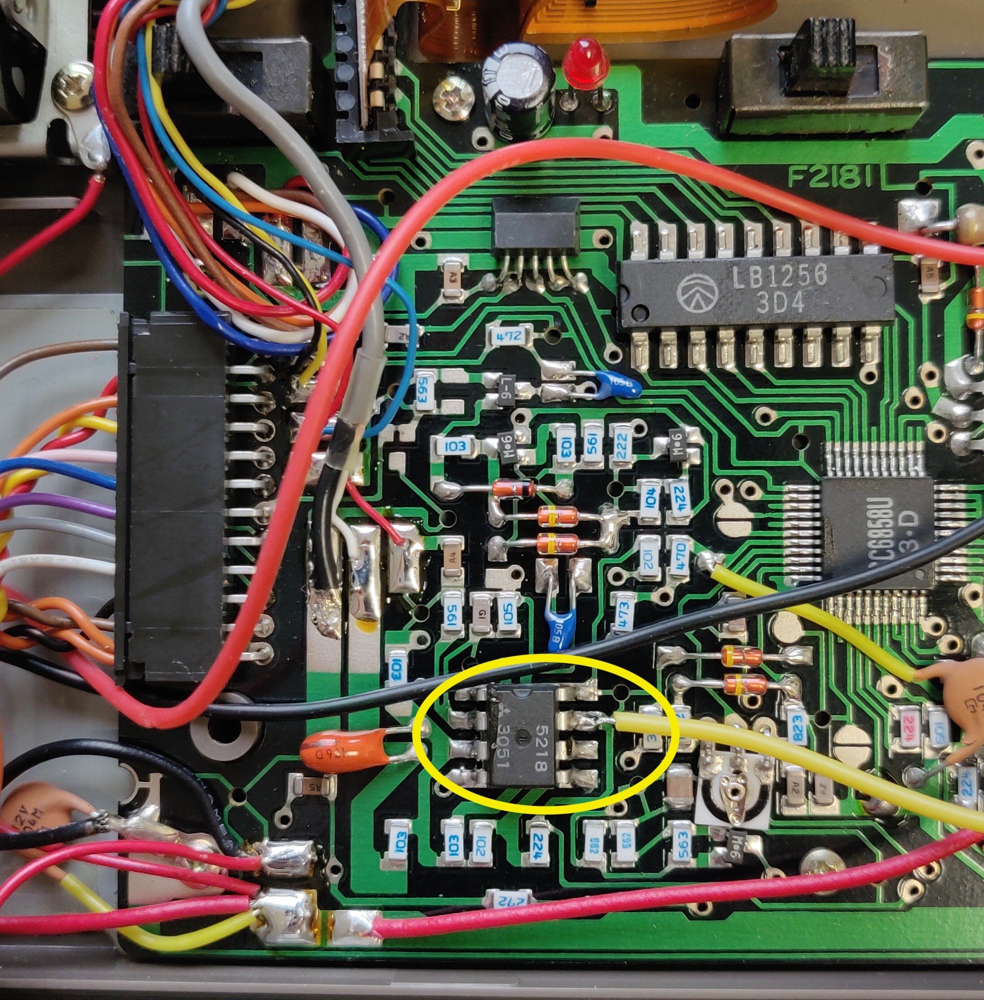

# Sharp PC-1251 & EC-125

This is a collection of example programs and tools for the Sharp PC-1251 and EC-125.

**Disclaimer:** None of these files are my own, the original examples are owned by Sharp and Pocket Tools is attributed below.

More information about this project can be found on my Retro website: [retro.engineer](https://retro.engineer/projects/2021-01-16_Sharp_PC-1251/)

### Audio directory

This contains audio recordings of the original example programs provided on the EC-125 micro-cassette, as well as a Dutch game presumably made by a previous owner of my device.

These files can be played back to the PC-1251 using the EC-125 audio-in connection.

## Basic directory

These are the basic files converted from the above audio files using Pocket Tools (see below)

Files A09 and A11 encountered errors during decoding and might not be reliable.

## EC-125 modification

The EC-125 only has an audio input and no option for audio output. But since I don't own any other micro-cassette players I decided to make a temporary modification to allow me to capture the audio.

I soldered a wire to the amplifier IC. This is the positive output of the audio signal, I used the battery ground as ground without any issue:



## Pocket Tools for macOS.

These are MacOS X binaries for the Pocket Tools available on [https://www.peil-partner.de/ifhe.de/sharp](https://www.peil-partner.de/ifhe.de/sharp) compiled and tested on macOS Catalina

Original sources are also included

wav2bin
```
Usage: wav2bin [Options] SrcFile(.wav/tap/img) [DstFile(.typ)]
SrcFile           : WAVe file (PCM, normalized, recommended is mono 16-bit with
                    a minimum sample rate from 22050 Hz (PC-1500 only 11025 Hz)
                    to 48 kHz or original wave files made by Bin2Wav)
DstFile           : Destination file (BASIC-program text or Binary image file)
Options
-t, --type=TYPE   : Destination file type
                     bas  BASIC-program text file (default), sha  shc Transfile
                     img  Binary image file (BASIC program, machine code, data)
                     rsv  ReSerVe mode data (image),   tap  Emulator raw format
-p, --pc=NUMBER   : SHARP pocket computer, (for BASIC-program text,
                     is required for 1421, 1600 Mode 1, optionally for other)
-c, --cspeed=VALUE: Ratio of CPU frequency to original (use it with a modified
                     Pocket Computer, if speedup was switched on, 0.94 to 2.7)
-u, --utf8=TYPE   : Convert special characters (only for BASIC-program text)
                     no   to ASCII transcription with brackets [reversible]
                     (yes), BOM: to UTF-8,  2esc: Escape seq,  2dos: to DOS-US
                     2asc to ASCII transcription for later serial transfer
-w, --width=VALUE : Minimum width of line number (only for BASIC-program text)
  | VAL[:|;|,|.|!]   2 to 10 (default: 5_), indentation off: 0, =VAL; for (: )
-q, --quiet       : Quiet mode (No display output)    2nd use: -w space_level.
    --tap         : from emulator tap,  --img=OFFSET: Image (Src file no wave)
    --version     : Display version information  -e, --endmark : write end mark
    --help        : Display this, more:  --help=r:recoding FAQ, =l:level(debug)
```

bin2Wav

```
Usage: bin2wav [Options] SrcFile(.typ) [DstFile(.wav/tap)]
SrcFile          : Binary image file (usually created by BAS2IMG or WAV2BIN)
DstFile          : WAVe file (default: SrcFile.wav) or tap file
-t, --type=TYPE   : Source file type
                     img  BASIC-program binary image (default) txt Text modus
                     bin  Binary assembly program or data   st,shc Transfile PC
                     dat  Data variable blocks (binary data)   asc ASCII Data
                     rsv  ReSerVe data (binary image)          bas ASCII Source
-p, --pc=NUMBER   : Sharp pocket computer, currently available 1211, 1245, 1251
                     1261, 1350, 1360, 1401, 1403, 1421, 1450, 1460, 1475, 1600
                     E500, E220, G850, 1500QT, SuperTape and more, default:1500
-c, --cspeed=VALUE: Ratio of CPU frequency to original (use it with a modified
                     Pocket Computer with speedup switched on, 0.2 to 2.7)
-a, --addr=VALUE  : 1. Start address, needed for BIN type, 2. Entry address
                     0 to 65535 or 0xFFFF, E500:0xFFFFFF (dflt: Manual. 2. no)
-s, --sync=VALUE  : Synchronisation duration, expressed in seconds, 2. Space
                     0.5 to 9 (default: 0.5 or minimum for the PC and waveform)
-nNAME, --name=   : Sharp file name (7 characters max, 16 for the PC-1500, E:8)
                     (default: DstFile without extension, nor path)  Subst:[HH]
-q, --quiet       : Quiet mode (minimal display output)
    --tap         : Destination file: Emulator tap byte format (not wave file)
    --version     : Display version information  -e, --endmark : end mark incl.
    --help        : Display this information,  --help=l : show option screen
-l, --level=VALUE : Print debug traces, more options, see help option screen
```

bas2img
```
Usage: bas2img [Options] SrcFile [DstFile]
SrcFile         : BASIC-program text file
DstFile         : Binary image file (default: SrcFile.img or .asc)
Options:
-p, --pc=NUMBER : Sharp pocket computer, currently supported
                   1150, 1211, 1245, 1248, 1251, 1261, 1280, 1350, 1360, 1401
                   1402, 1403, 1421, 1425, 1430, 1445, 1450, 1460, 1475, 1500
                   1600, E220, G850 and more (default: 1500),
                    Only at E500 series must be used the commands 'TEXT'
                    and then 'BASIC' after the transfer of an img.
-k, --keywords=KeywordFile (for tokens of add-on hardware, max. use: 3 times)
-o, --codepoints=CodepointFile (code points def. file, maximum use: 2 times)
-t, --type=TYPE : destination file type (default: img),  asc,txt,asm,asm5,asm6
                  img  BASIC Program binary image with intermediate code
                  txt  TEXT mode image,  asc  ASCII file: Text Menu Cmt/serial
-e, --endmark   : Append an end mark to the file,     -u, --utf8= (yes),no,dos
-q, --quiet     : Quiet mode (minimal display output) -a, --auto= AUTO_inc(10)
    --version   : Display version information --help: Display this information
-l, --level=SUM : 1     Don't/Do compile fixed line no. (in line) =0x1000:ELbl
   (max use 2x) : 2     Append missing apostrophes at end of line =0x2000: Bgn
                : 4     Don't replace shortcuts(.) with commands, =0x100: SJIS
                : 8     Don't convert to upper case, 0x10 Disable preprocessor
                : 0x80 (0x20) Print lines in,        0x40 Print values out
                : 0x800 Depress some line errors, result may not editable
```
